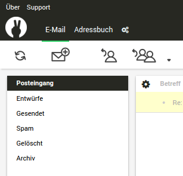

Mabola: Dark Theme for Roundcube Webmail
==================================



This theme is based on and refers to https://github.com/EstudioNexos/mabola

# Install
```bash
# go to roundcube webmail skins path
cd /usr/local/lib/roundcubemail/skins
# Clone mabola this theme is based on
git clone https://github.com/EstudioNexos/mabola.git
# Clone this theme
git clone https://github.com/JumpLinkNetwork/roundcube-theme-mabola-dark.git mabola-dark
# Go to plugin folder
cd ../plugins/
# Install threecol plugin
git clone https://github.com/EstudioNexos/threecol.git
# Create link for this theme
cd threecol/skins
ln -s mabola mabola-dark
# activate threecol plugin
cd ../../..
vim config/config.inc.php
# Add add this plugin to `$config['plugins'] = array('threecol', ...;`
# and append `$config['previewpane_layout'] = 'right';` to the end of the config file
```

# See also
* https://github.com/EstudioNexos/mabola
* https://github.com/EstudioNexos/threecol


